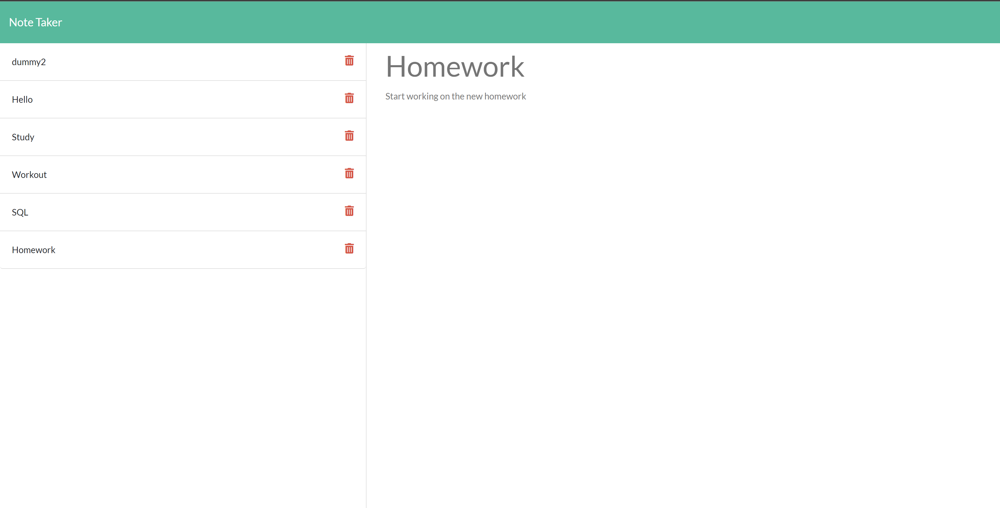

[](https://opensource.org/licenses/MIT)
# 11-Express.js-Note-Taker
## Description
Nodejs note taker application, deployed on Heroku & built using Express JS, that allows the user to view, add & delete notes.


## Table Of Contents
<li><a href="#installation">Installation</a></li>
<li><a href="#usage">Usage</a></li>
<li><a href="#demo">Demo</a></li>
<li><a href="#license">License</a></li>
<li><a href="#questions">Questions</a></li>

## Installation
The modules used in this application are [Express.js](https://expressjs.com/) to set up & handle all the http requests, routing & middleware required for the application to run. [Heroku](https://www.heroku.com/home) was used to host the application.

To install necessary dependencies, run the following command:
```sh
npm install
```

## Usage
Must have [Node.js](https://nodejs.org/en/) downloaded

Then run the following command: 
```sh 
node server.js
```

OR

If you have nodemon installed then run: 
```sh
nodemon
```

## Demo
[Heroku Deployement Link](https://possessed-corpse-09283.herokuapp.com/notes)



## License
This project is licensed under the MIT https://opensource.org/licenses/MIT


## Questions
If you have any feedback please feel free to reach out at my github https://github.com/youssefojeil or by email at youssef.ojeil@hotmail.com.